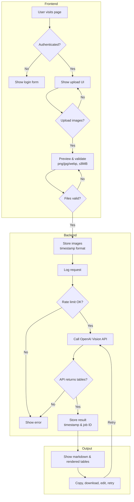

# Project: SFK Document Table Extractor

Below is a **detailed and annotated AGENTS.md**.
It explains the full architecture, agent roles, build steps, and requirements—optimized for Codex.

**Purpose:**  
A simple, secure web app for uploading field documents (images) and extracting two structured tables (Arrival/Departure conditions) using OpenAI Vision models.  
Outputs are shown in markdown and rendered table format, with full audit and user features.



---

## 1. Solution Architecture

### 1.1. Stack Overview
- **Frontend:** Modern, minimal, drag & drop + multi-upload. Secure login.
- **Backend:** Python (Flask or FastAPI), OpenAI API integration, file storage, rate-limiting, SQLite DB.
- **Deployment:** Docker Compose, .env for config, single-command update.
- **Testing:** Simple unit/integration scripts.
- **Security:** Password-protected, API keys hidden, safe file handling.

---

## 2. User Flow & Requirements

1. **User lands on login page.**
   - Enter password “API2025” to access (session-based).
2. **User uploads one or more image files** (png, jpg, webp, ≤8MB each).
   - Drag-and-drop or file picker.
   - Preview thumbnails shown before upload.
3. **On upload:**
   - Images stored with filename: `YYYYMMDD-hhmmss` (UTC).
   - All requests logged to DB (filename, time, user/IP, etc).
4. **Each image sent to OpenAI Vision API** with structured prompt:

      ```
      Please analyze the attached image and extract the tank data as two separate tables, in markdown format:
      
      - The first table should show **arrival conditions**.
      - The second table should show **departure conditions**.
      
      Each table should list all individual tanks and use the following columns (with these exact headers):
      
      | Tank | Product Name | API | Ullage (Ft) | Ullage (in) | Temp (°F) | Water (Bbls) | Gross Bbls | Net Bbls | Metric Tons |
      | ---- | ------------ | --- | ----------- | ----------- | --------- | ------------ | ---------- | -------- | ----------- |
      
      If a value is missing or unclear, leave the cell blank.  
      Output only the two markdown tables: one for arrival, one for departure.  
      Do not include any other commentary, summary, or text.
      ```

   - Model: `o4-mini` (o4-mini or configurable via backend)
   - API key securely stored (.env)
   - If error, raw error message shown.

5. **Outputs:**
   - Show both raw markdown and a rendered table view (side by side or toggle).
   - Show job timestamp + 5-char random ID (e.g. `20250613-1328-H8Z5W`).
   - One-click “Copy Markdown”, “Download Markdown”, “Edit & Retry”.
   - Prompt and model version shown for transparency.

6. **Backend:**
   - Enforce 50 requests/hour per user/IP.
   - Store all request data (input file, timestamp, prompt, output) in DB.
   - Configs via `.env` (API key, rate limit, password, etc).

7. **Admin/Dev:**
   - Simple Docker deploy: `git pull && docker-compose up -d --build`
   - Update instructions, test scripts included.
   - All code modular and easy to extend.

---

## 3. Implementation Steps (For Codex Agents)

### 3.1. Directory Structure

````

/
├── backend/
│   ├── app.py
│   ├── models.py
│   ├── db.sqlite3
│   ├── utils.py
│   └── ...
├── frontend/
│   ├── index.html
│   ├── main.js
│   ├── style.css
│   └── ...
├── .env.example
├── Dockerfile
├── docker-compose.yml
├── AGENTS.md
└── README.md

````

### 3.2. Backend (Python Flask or FastAPI)
- Accepts login, manages session.
- Handles file upload (drag/drop & picker, batch).
- Validates file (type/size).
- Renames and stores files as `YYYYMMDD-hhmmss`.
- Stores metadata/output in SQLite.
- Calls OpenAI API (vision endpoint, prompt as above, model configurable).
- Implements rate limiting (e.g., Flask-Limiter).
- Serves markdown and rendered HTML.
- Handles errors transparently.

### 3.3. Frontend (Vanilla JS or React)
- Login screen (password, session cookie).
- Drag & drop + multi-upload widget (preview thumbnails).
- Display output: markdown (copy/download), rendered table, job ID/timestamp.
- “Edit & Retry” button (lets user tweak prompt & resubmit).
- Clean, modern design (tailwind, Material, or minimal CSS—up to dev).

### 3.4. Database (SQLite)
- `uploads` table: id, filename, timestamp, user/IP, prompt, model, output, job ID.
- Optional: results retrieval, download history.

### 3.5. Security
- All sensitive data in `.env` (never commit real API keys).
- Password-protect UI/backend.
- Validate and sanitize all inputs.
- Serve app behind HTTPS for production.

### 3.6. Rate Limiting
- Enforce 50 uploads/hour per user/IP.
- Show friendly error if limit exceeded.

### 3.7. Deployment
- Provide `docker-compose.yml` and `Dockerfile` for backend+frontend.
- Deploy/update with:
  ```bash
  git pull
  docker-compose up -d --build


* Test scripts: `pytest` for backend, Cypress or similar for UI.

---

## 4. Optional: Testing & Scripts

* **Unit tests:** For file validation, API calls, DB logging, rate limit.
* **Integration tests:** Simulate full user workflow (login, upload, output).
* **One-click deploy:** Bash script to update and restart app.

---

## 5. Configuration (.env Example)

```env
OPENAI_API_KEY=sk-xxxxxx
UPLOAD_FOLDER=/app/data
ALLOWED_EXTENSIONS=png,jpg,jpeg,webp
MAX_FILE_SIZE_MB=8
LOGIN_PASSWORD=API2025
RATE_LIMIT_PER_HOUR=50
MODEL=o4-mini
```

---

## 6. Prompt Engineering Notes

* Use **consistent, explicit prompts** (as above).
* If errors/garbled tables, allow admin to edit prompt and retry.
* Model version is configurable for future-proofing.

---

## 7. Agent Roles

* **Frontend Agent:**

  * Build secure, modern, minimal login and upload UI.
  * Ensure drag/drop + batch upload + previews.
  * Display both markdown and rendered tables.
  * Provide copy, download, and retry actions.

* **Backend Agent:**

  * Handle all file ops and API requests.
  * Implement login, session, rate limit, storage, logging.
  * Return detailed errors and allow prompt tweaks.
  * Store results for retrieval, log all actions in DB.

* **DevOps Agent:**

  * Ensure Docker, `.env`, CI/CD, and scripts for easy deploy/update.
  * Document all steps clearly in README.

* **Testing Agent:**

  * Provide simple test scripts to validate main flows (upload, output, rate limit).

---

## 8. Future Extensions

* PDF/image auto-rotation, PDF support, advanced table correction, etc.
* Multi-user management, admin interface, analytics.

---

## **Summary of Key Requirements**

* **Frontend:**

  * Clean, modern, elegant style
  * Drag-and-drop and traditional file upload
  * Batch upload (multiple images)
  * Visual preview of uploaded images
  * Simple password-protected page (“API2025”)
  * Display both markdown and rendered tables
  * Copy and download markdown with one click
  * Show output timestamp and random 5-char job ID
  * “Edit and retry” on output

* **Backend:**

  * Python (Flask or FastAPI recommended for rapid prototyping)
  * Store images, renaming as `YYYYMMDD-hhmmss` (timestamped)
  * Only accept images (png, jpg, webp, ≤8MB)
  * Log each request (filename, timestamp, output)
  * Store output for retrieval (simple DB, e.g., SQLite)
  * Limit to 50 requests/hour (rate limiting per user/IP)
  * All sensitive config via `.env`
  * Password-protect endpoint (session-based)
  * Show raw API errors for transparency
  * Allow model selection/config upgrade
  * Allow users to see prompt for debugging

* **DevOps:**

  * Dockerized (simple compose file)
  * Easy deployment: `git pull` + `docker-compose up -d --build`
  * Optional test scripts (unit/integration)
  * One-click deploy/update script
  * Designed for low concurrency/single-user access

# End of AGENTS.md

